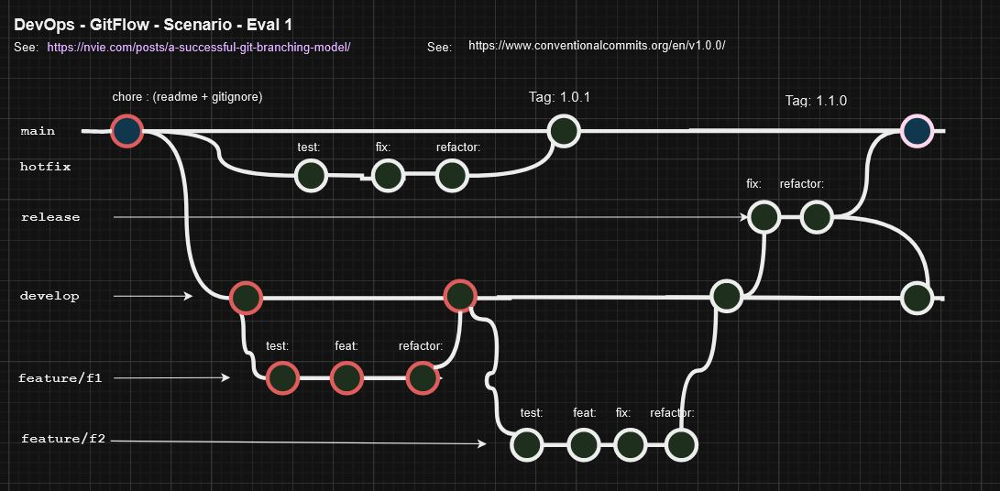

# SIG 2 - Evaluation pratique 2024 - Docker

## Enoncé

Lors de cette épreuve, nous allons valider les compétences suivantes:

* utilisation des commandes git de base (en local)
* application correcte du git-flow (nvie)
* lecture et analyse d'un arbre (tree) produit par git-flow

## Moyens à disposition

| Critère    | Valeur |
| -------- | ------- |
| Accès internet | oui |
| Travail collaboratif | non |
---

## Préparation de votre environnement

* réaliser un fork du dépôt livré

```
via github
```

* "cloner" votre dépôt

```
git clone <votreUrl>
```

* initialiser git-flow

```
git flow init
```

* mettre à jour la branche develop avec le dépôt distant (en étant sur la branche develop)

```
git pull
```

* copier le fichier "reponse.md" hors de votre dépôt local

## Etats de l'arbre

* Schéma Draw IO



* Les "commits" rouges sont ceux déjà présents. Les autres sont à produire par vos soins.

#### Critères d'évaluation

| Critère    | Valeur | Pondération |
| -------- | ------- | --- |
| Hotfix | Toutes les étapes sont présentes | 5pts |
| Feature F2 | Toutes les étapes sont présentes | 4pts |
| Release | Toutes les étapes sont présentes | 6pts |
| Chronologie des branches | Selon le schéma draw io   | 6pts |
| Bonnes pratiques de commits (préfixes) | Selon le schéma draw io   | 3pts |
| Bonus | Combien de branches doivent être présentes sur le dépôt à la fin ???   | 1pt |

---

## Arbre à obtenir à la fin du travail

```git
git log --graph --oneline --decorate --all
```

```
λ git log --graph --oneline --decorate --all
*   37334d3 (HEAD -> develop) Merge tag '1.1.0' into develop
|\
| *   fad3245 (tag: 1.1.0, main) Merge branch 'release/1.1.0'
| |\
| | * 914cdd8 refactor:
| | * 46b3c87 fix:
| | * 6ac15a7 test:
| |/
|/|
* |   3f22803 Merge branch 'feature/f2' into develop
|\ \
| * | 6147660 refactor:
| * | 63401fb fix:
| * | 2d58ecb feat:
| * | 2c9a2f9 test:
|/ /
* | cd409fe Merge tag '1.0.1' into develop
|\|
| *   5899bd8 (tag: 1.0.1) Merge branch 'hotfix/1.0.1'
| |\
| | * ee319ec refactor:
| | * 259fff5 fix:
| | * f03107f test:
| |/

---------------------------------------------------- //point de départ

* |   c20b028 Merge branch 'feature/f1' into develop
|\ \
| |/
|/|
| * b839c2e refactor:
| * ffe54cd feat:
| * 6d0d436 test:
|/
* 9975104 chore:
```

## Modalités de livraison

* Sauf le fichier "reponse.md", tout est livré sur votre dépôt.
* Le fichier "reponse.md" est envoyé dans le canal teams afin d'annoncer la fin du travail.